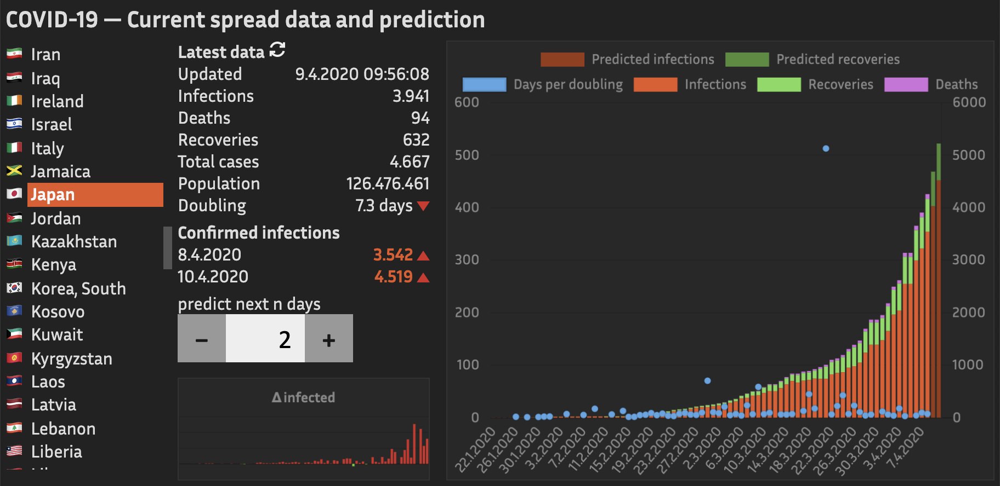

# Covid-19

_Visualization of Covid-19 spread and predicted total cases_



## Prerequisites

 - Node.js ≥ 10
 - Git ≥ 1.8
 - Python ≥ 3.6
 - a web server which can serve static files (no PHP or other server-side logic required)

## Installation

The [code](https://github.com/ola-ct/COVID-19) for this web app is hosted on GitHub. To clone the repository and its submodules enter the following on a command-line:

```
git clone https://github.com/ola-ct/COVID-19.git
git submodule init
cd COVID-19
```

## Deployment

The latest Covid-19 spread data is fetched from Johns Hopkins' Center for Systems Science and Engineering ([CSSE](https://coronavirus.jhu.edu/map.html)) [repository](https://github.com/CSSEGISandData/COVID-19). Type 

```
gitmodule update --remote
```

to update the data residing in the two Git submodules.

Before deploying this app to a web server, some JSON files have to be generated from this data using bin/update-data.py. This script has some dependencies which you can resolve by executing

```
pipenv install
```

After that you may run the script with

```
pipenv run bin/update-data.py
```

This will generate the aforementioned JSON files containing the latest spread data for each country.

Now the data is prepared you can prepare the code to being deployed to a webserver.

This app uses [webpack](https://webpack.js.org/) to bundle the files from src/ into the deployment directory dist/.

If you haven't done it already, install the necessary Node modules: 

```
npm install --save-dev
```

After that you can bundle the files by running

```
npm run build
```

or, alternatively

```
npx webpack
```

Now you can copy the files in dist/ to the web server of your choice. bin/deploy.sh contains a template for a script that copies the files via SSH to a remote directory:

```
DIST=dist
SERVER=<the host name or IP address of your web server>
REMOTE_DIR=<the directory to deploy to>
tar -C ${DIST} -czf - . | ssh ${SERVER} "(tar -C ${REMOTE_DIR} -xzf - )"
```

Feel free to modify it according to your enviroment.


## License

Copyright &copy; 2020 [Oliver Lau](mailto:oliver@ersatzworld.net)

This program is free software: you can redistribute it and/or modify it under the terms of the GNU General Public License as published by the Free Software Foundation, either version 3 of the License, or (at your option) any later version.

This program is distributed in the hope that it will be useful, but WITHOUT ANY WARRANTY; without even the implied warranty of MERCHANTABILITY or FITNESS FOR A PARTICULAR PURPOSE.  See the GNU General Public License for more details.

You should have received a copy of the GNU General Public License along with this program. If not, see [http://www.gnu.org/licenses/](http://www.gnu.org/licenses/).

---

Dieses Programm ist freie Software. Sie können es unter den Bedingungen der [GNU General Public License](http://www.gnu.org/licenses/gpl-3.0), wie von der Free Software Foundation veröffentlicht, weitergeben und/oder modifizieren, entweder gemäß Version 3 der Lizenz oder (nach Ihrer Wahl) jeder späteren Version.
